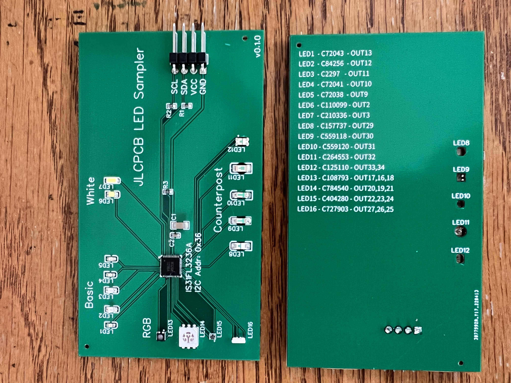

# LED Sampler

This project is a result of messing up with reverse mount (sometimes called
counterpost) LEDs in other projects. Since I use [JLCPCB](https://jlcpcb.com/)
quite a bit, I added a bunch of other LEDs from their catalog.

The following types of LEDs are demoed:

* Basic LEDs - these are priced favorably by JLCPCB since they're already loaded
  into their pick and place machines
* White LEDs
* RGB LEDs - various sizes. One is a side view LED
* Counterpost LEDs - these shine out the opposite side of the board. They're
  more than just LEDs mounted upside-down. Some of them have square holes for
  their plastic lenses.

Here's what it looks like:

The LED driver is IS31FL3236A with I2C address 0x3C. (Somehow I typo'd the
silkscreen.) Connections are listed on the back of the board and in the
schematic.

